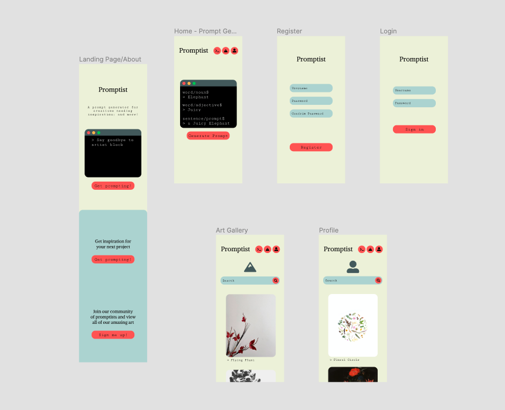
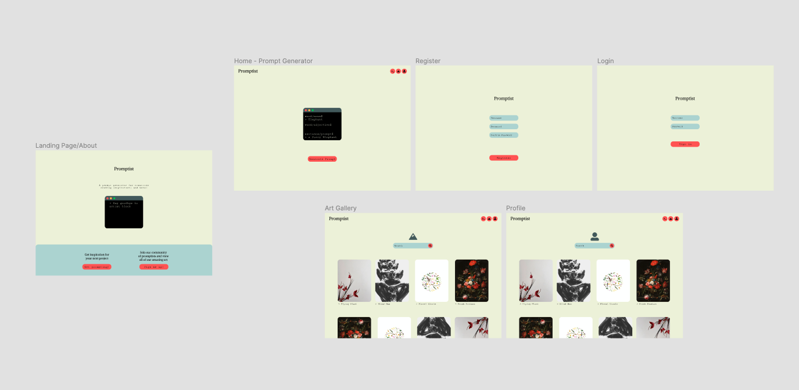

# Promptist

## Description

Promptist is a prompt generator for creatives who have artist's block; and a collective platform for artists of all mediums to showcase their works resulting from that prompt.

### Technologies Used

- Django
- PSQL
- django-sass 1.0.1(SASS Compiler)
- django-fontawesome-5 (icons)
- Cloudinary
- Pillow

### Wireframes

#### Initial planning on figma for layout and navigation ideation 
Mobile Layout 
 
Desktop Layout 

### User Stories

User should be able to:
- Navigate to their intended destination with the given buttons/navigation options.
- Generate useful prompts that helps break through their artist block.
- Have the ability to register if they want to have access to upload and gallery functionality.
- Upload their artwork if they are logged in.
- Search to filter through the gallery/their uploaded works.

---

## Planning and Development Process

Phase 1: Pre-Project week 
Finish up the layouts and planning of the database. Set-up django with webpack and SASS so that everything is ready by Monday.

Phase 2: First half of Project Week 
text placeholder

#### Example image placeholder for proj week first half 

Phase 3: The final stretch; Finishing up the Project 
text placeholder

#### Example image placeholder for proj week first half 

### Problem-Solving Strategy

text placeholder

### Unsolved problems

text placeholder

---
